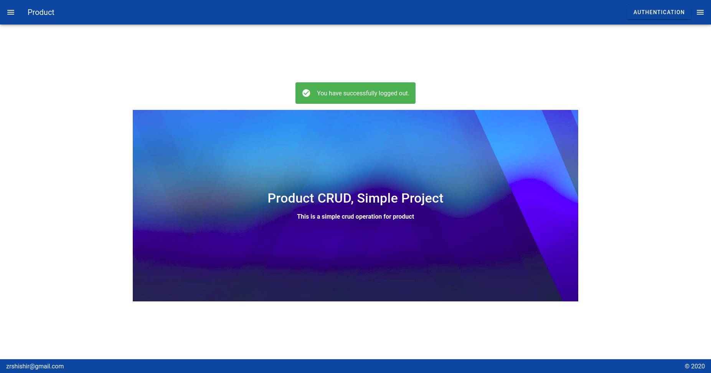

# product front end crud project

## Tech Specifications
	- "core-js": "^3.6.5".
    - "vue": "^2.6.11".
    - "vue-router": "^3.2.0".
    - "vuetify": "^2.2.11".
    - "vuex": "^3.4.0".

### Features
	1. Authentication, warning messages and success messages
	2. Sign up page with front end validation
	3. Sign in page with front end validation
	4. Log out functionalities
	5. Product module with data tables and pagination
	6. Product creation form with success message
	7. Image upload functionality using base64 encoded

## Project setup
	Project setup details are described below step by step: The backend api for this project is [here](https://github.com/zrshishir/product-backend)
		1. Download or clone the project from [Product Frontend](git@github.com:zrshishir/product-frontend.git). 
		2. Go to the project's root directory and run the command `npm install`
		3. Go to the `/src/api` directory and edit the `product-frontend.js`. Assign your domain name with `ROOT_URL`. 
			`const ROOT_URL = 'your-domain-name/api'`
		4. Go to your root direcotory and run `npm run serve`

### screenshots of working procedure details
	The working procedure is described below with screenshots:
	1. To install this project you will have node installed. I will describe it using `npm`. You can install this project two ways
		- Download the zip file from the repository and extract it on your pc

		- clone the project using git and the command is `git clone git@github.com:zrshishir/product-frontend.git`. 

	2. Go to the project's root directory and run the command `npm install`

	3. Go to the `/src/api` directory and edit the `product-frontend.js`. Assign your domain name with `ROOT_URL`. 
			`const ROOT_URL = 'your-domain-name/api'`

	4. Go to your root direcotory and run `npm run serve`

### Some screenshots of the project
	1. Home page 

	2. Sign up or Registration page

	3. Login or Sign in page

	4. Registration or login message on home page with log out button and product menu

	5. Product page

	6. Product creation page

	7. Product edit page

	8. Product delete page

<<<<<<< HEAD

	9. Log out message					

=======
	9. Log out message
					
>>>>>>> e1308731ecd880a3cd293ba33530575ca82a801a
